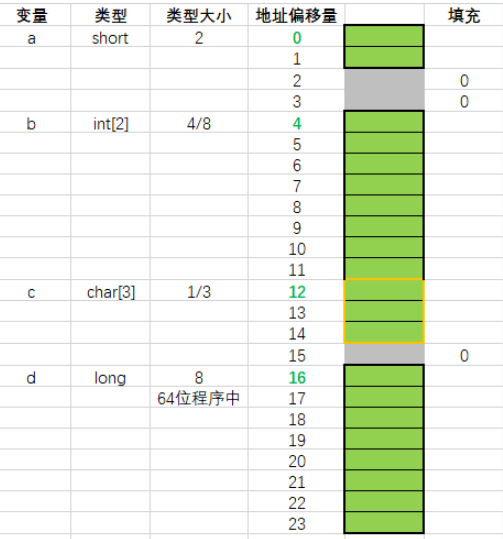

# C++拾遗

## union与struct

1. 在存储多个成员信息时，编译器会自动给struct每个成员分配存储空间，==struct 可以存储多个成员信息==，而==union中，每个成员共用一个存储空间==，只能存储最后一个成员的信息。 

2. 都是由多个不同的数据类型成员组成，但在任何同一时刻，==union只存放了一个被先选中的成员，而struct的所有成员都存在==。 

3. 对于union的不同成员赋值，将会对其他成员重写，原来成员的值就不存在了，而对struct 的不同成员赋值是互不影响的。 注：在很多地方需要对struct的成员变量进行修改。只是部分成员变量，那么就不能用联合体union，因为union的所有成员变量占一个内存。eg：在链表中对个别数值域进行赋值就必须用struct。

4. union中数据成员是不能有构造函数的。因为union数据成员共享内存，union构造函数在执行的时候，不能调用数据成员为类对象的构造函数，否则就改变了其他数据成员的值；同样，union的对象成员的析构函数也不能被调用，因为其他数据成员的值对于对象成员而言可能毫无意义。

## 字节对齐

**struct计算要遵循字节对齐原则。**

struct默认的字节对齐一般满足三个准则：

- struct变量的首地址能够被其==最宽**基本**类型成员==的大小所整除；
- struct每个成员相对于结构体首地址的偏移量（offset）都是成员大小的整数倍，如有需要编译器会在成员之间加上填充字节（internal adding）；
- struct的总大小为结构体最宽基本类型成员大小的整数倍，如有需要编译器会在最末一个成员之后加上填充字节（trailing padding）

> [!NOTE]
>
> 其实暂且不管这三原则，我的方法只要记住第三个，就是结构体大小结果要为成员中最大字节的整数倍。

```c++
struct S1{char a; short b; char c; };	// sizeof(S1) = 6

struct S2{char a; char b; short c; };		// sizeof(S2) = 4
```

- 首先找出成员变量中最大的字节，可见对于 `S1` 和 `S2`最大是 short ，占 2 个字节；

- 所以以后都已2个字节为准，也就是说最多只要2个字节，其他填充占位，注意下图一个格子表示一个字节；

- 所以先画2个格子，以后看成员顺序，逐次增加，每次一2为增加基准。

  对于`S1` 来说，顺序是 `char->short->char `

  

  所以对于 `S1` 结构体大小为 2*3=6，至于为什么第二个 char，多的那个字节不丢掉，就是遵循第三个原则，就是struct大小结果要为成员中最大字节的整数倍。

对于`S2` ，顺序是 `char->char->short`：


```c++
struct X1 {char a; int b; char c;}x1;		//sizeof(x1) = 12
```


上图中的`x1.a`大小为1，`x1.b`大小为4，`x1.c`大小为1。
`x1.a`的地址偏移量为0，占据1个内存偏移量。
按照内存对齐规则，`x1.b`的类型大小为4，因此其地址偏移量需要是4的整数倍，因此应该从偏移量4开始存放，即`x1.a`的后面需要填充3个0。
`x1.b`存放完后，偏移量来到了8。
`x1.c`的类型大小为1，由于偏移量8为1的整数倍，但存放完`x1.c`后，整体内存大小为9。由于9不能整除`x1.b1`的类型大小(4)，因此需要填充到12（12可以整除1和4）。
填充完毕后，整个结构体的内存大小为12。

```c++
struct X2 {	
    short a;
    int b[2];
    char c[3];
    long d;
}x2;	//24
```



上图中的`x2.a`大小为2；`x2.b`为整型数组，类型大小为4，内存占据大小为8；`x2.c`为字符型数组，内存占据大小为3；`x2.d`在64位程序中内存大小为8。
`x2.a`的地址偏移量为0，占据2个内存偏移量。
按照内存对齐规则，`x2.b`的类型大小为4，因此其地址偏移量需要是4的整数倍，因此应该从偏移量4开始存放，即`x2.a`的后面需要填充2个0。
`x2.b`存放完后，偏移量来到了12。
`x2.c`的类型大小为1，由于偏移量12为1的整数倍，可以继续存放完`x2.c`后，内存偏移量来到15。
按照内存对齐规则，`x2.d`的类型大小为8，由于15不能整除`x2.d`的大小（8），因此需要填充到16（16可以整除2、1、4和8）。
存放完`x2.d`后，内存偏移量来到了24。由于24可以整除2、1、4、8，因此结构体整体内存大小为24。

### **结构体内嵌结构体**

```c++
	struct S1{
		char a;
		int b;
		char c;
	};

	struct{
		short a;
		struct S1 ss1;
		char c;
	}s2; //20

```


上图中的`s2.a`大小为2；`s2.ss1`为内嵌的结构体，其最大的数据类型大小为4，占据内存大小为12；`s2.c`的类型大小为1。
`s2.a`的地址偏移量为0，占据2个内存偏移量。
按照内存对齐规则，`s2.ss1`的内嵌结构体中最大类型int的大小为4，因此`s2.ss1`地址偏移量需要是4的整数倍，因此应该从偏移量4开始存放，即`s2.a`的后面需要填充2个0。
`s2.ss1`存放完后，偏移量来到了16。
`s2.c`的类型大小为1，由于偏移量16为1的整数倍，可以继续存放完`s2.c`后，内存偏移量来到17。
由于17不可以整除2、4、1，因此需要填充到20，填充完毕后，结构体整体内存大小为20。

**union大小计算**

union的长度由==最大长度的成员==与==类型长度最大的成员==共同决定，其长度是类型长度最大的成员长度的整数倍。

1、联合体的大小取决于他所有成员中**占用空间最大的一个成员**的大小。

2、当最大成员大小不是最大对齐数的整数倍的时候，就要**对齐到最大对齐数类型的整数倍**。

```c++
union A{
    long long i;	//8		类型长度最大的成员
    char j[10];		//10	最大长度的成员
    int k;			//4
};	// sizeof(A) = 16
```

> [!IMPORTANT]
>
> 一般设置的对齐方式为1，2，4字节对齐方式。结构的首地址必须是结构内最宽类型的整数倍地址；另外，结构体的每一个成员起始地址必须是自身类型大小的整数倍(需要特别注意的是windows下是这样的，但在linux的gcc编译器下最高为4字节对齐），否则在前一类型后补0。

### 联合体内嵌联合体

```c++
union U1{
	char a[6];
	int b;
	char c;
};

union{
	char a[9];
	int b;
	union U1 uu1;
}u2; //12

```


`u2.a`的类型为字符型数组，占据内存空间大小为9；`u2.b`内存大小为4；`u2.uu1`为内嵌的联合体，其内存空间大小为8，即该u2.uu1占据空间为8。
根据联合体大小的规则，成员中占据内存空间最大的为`u2.a`为9，但9不是2、4、1的整数倍，因此需要填充到12。填充完毕后，联合体的整体内存大小为12。

### 结构体内嵌联合体

```c++
union U1{
	char a[6];
	int b;
	char c;
};

struct{
	short a;
	union U1 uu1;
}s4; //12

```


`s4.a`的类型大小为2，地址偏移量为0，占据2个内存偏移量。
`s4.uu1`的内存大小为8，其内最大类型int的大小为4，因此偏移量需要是4的整数倍，因此应该从偏移量4开始存放，占据8个内存空间。
`s4.uu1`存放完后，偏移量来到了12。由于12是2、1、4的整数倍，因此该结构体s4的内存大小为12。

### 联合体内嵌结构体

```c++
struct S1{
	char a;
	int b;
	char c;
};

union U1{
	char a[6];
	int b;
	struct S1 ss1;
}u5; //12
```


`u5.a`的类型为字符型数组，内存大小为6；`u5.b`占据的内存大小为4；`u5.ss1`占据的内存大小为12。
根据联合体大小的规则，最大成员`u5.ss1`占据的内存大小为12。由于12是2、1、4的整数倍，因此该联合体`u5`的内存大小为12。

### 指定字节对齐

```c++
#pragma pack(1)

struct{
	char a[2];
	int b;
	short c;		
}s6;
```


由于在结构体`s6`的前面有`#pragma pack(1)`，因此采取紧凑排列的方式，内存上如上图的方式。整体紧凑排列存放后，结构体的内存大小为8。


由于在结构体s6的前面有`#pragma pack(3)`，因此采取3为对齐字节数的方式。
`s6.a`的地址偏移量为0，占据2个内存偏移量。此时地址偏移量来到2，由于`s6.b`类型为int，类型大小为4，且2不是3的整倍数，因此需要补充1个0填充到3。
`s6.b`存放到地址偏移量为3的位置，存放完毕后，地址偏移量来到了7。由于7不是3的整倍数，因此需要补充2个0填充到9。
`s6.c`存放到地址偏移量为9的位置，存放完毕后，地址偏移量来到了11。由于11不是3的整数倍，因此需要补充1个0填充到12。
全部填充完毕后，该结构体整体内存大小为12。

> [!WARNING]
>
> 此处的对齐字节3，只是为了测试。在某些GCC中，会严格要求对齐字节按照2m2m来进行选择，因此可能会出现如下报错信息：

```c++
main.c: In function ‘main’:
main.c:56:10: warning: alignment must be a small power of two, not 3 [-Wpragmas]
56 |  #pragma pack(3)
|          ^~~~
```


由于在结构体`s6`的前面有`#pragma pack(8)`，因此采取8为对齐字节数的方式。但结构体`s6`的所有成员中最大类型int的大小为4，而此时指定的对齐字节8已经超过结构体成员类型的最大值，因此继续采取最大类型的大小作为对齐数。
`s6.a`的地址偏移量为0，占据2个内存偏移量。
`s6.b`类型大小为4，因此当前地址偏移量2不满足条件，因此需要补充2个0填充到4来存放。
`s6.b`存放完毕后，地址偏移量来到8。由于`s6.c`类型大小为2，当前偏移量8满足条件，因此继续存放。
`s6.c`存放完毕后，地址偏移量来到10。由于10不是2、4的整数倍，因此需要补充2个0来到12。

### 取消指定字节对齐的大小

```c++
	struct{
		char a[5];
		short b[2];	
		long c;		
	}s6; //24

	#pragma pack(4)

	struct{
		char a[5];
		short b[2];	
		long c;		
	}s7; //20

	#pragma pack()	

	struct{
		char a[5];
		short b[2];	
		long c;		
	}s8; //24

```


此处按照4字节对齐，`s7.a`和`s7.b`的类型大小都是小于4的，按照其自身类型的整数倍来进行对齐；
但`s7.c`类型大小为8，超过了指定的4，因此指定生效，`s7.c`按照4的整数倍对齐，即上图中的地址偏移量12处进行存放`s7.c`。
存放完毕后，整体地址偏移量来到20，刚好满足指定字节的整数倍，因此整体结构体内存大小为20。


此处已经使用了`#pragma pack()`取消了4字节对齐，因此此处采取各个结构体成员类型的整数倍进行对齐。

### 指定字节对嵌套结构体的影响

```c++
	#pragma pack(4)	
	
	struct S2{	
		char a[3];
		long b;
		int c;
	};	
	
//	#pragma pack()	

	struct{	
		char a[5];
		short b[2];
		struct S2 ss2;
		long c;
	}s8; //36	

```

不取消指定对齐、对嵌套的影响：
依旧采取前面指定的字节对齐，且内嵌的结构体也会采取该字节对齐。


此处已经设置了`#pragma pack(4)`，按照4字节对齐，因此结构体`s8`的成员应该均按照4字节进行内存偏移量对齐：
`s8.ss2`中的`long b`和`s8.c`的类型长度为8，超出了指定的4字节对齐，因此需要按照4字节对齐进行存放。
因此如果`ss2.a`地址偏移量为0时，`ss2.b`就从偏移量4开始存放。
因此在结构体`s8`的内存示意图中，`s8.b`从偏移量8开始存放，`s8.ss2`从12开始存放，`s8.c`从28开始存放。
全部存放完毕后，地址偏移量来到36，刚好满足是指定4字节对齐的整数倍，因此不需要再进行填充。

### 取消字节对嵌套结构体的影响

```c++
	#pragma pack(4)	
	
	struct S2{	
		char a[3];
		long b;
		int c;
	};	
	
	#pragma pack()	

	struct{	
		char a[5];
		short b[2];
		struct S2 ss2;
		long c;
	}s8; //40	

```

在嵌套结构体前取消指定位数对齐，此时后面的嵌套结构体中嵌套的长度仍然按前面字节对齐进行；
在取消对齐前定义的结构体，在取消对齐之后再调用，仍然按之前对齐的字节来执行。
嵌套的结构体的最大类型长度是包含了嵌套结构体内类型，即全部成员的类型的最大长度来对齐。


此处在结构体s8的前面已经使用了`#pragma pack()`取消了前面设置的指定4字节对齐的要求，因此此处的`s8`按照其结构体成员的类型大小来在内存中进行存放。
由于`s8`内部嵌套的结构体`ss2`在`#pragma pack()`之前，因此依旧按照指定4字节对齐的要求来进行存放（图中类型大小的橙色字体的4），即如果`ss2.a`从地址偏移量0开始存放，`ss2.b`就从地址偏移量4开始存放。