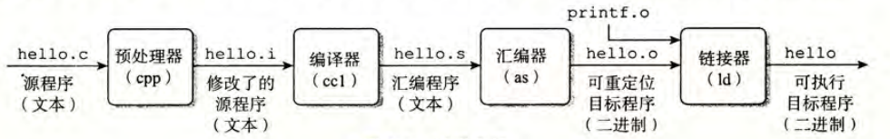

---

title: 第一章 计算机系统漫游
categories: [书籍阅读, CSAPP, 第一章 计算机系统漫游]
tags: 计算机基础

---

# CSAPP

Our story will begin with "Hello, World."

```c
// hello.c
#include <stdio.h>
int main() 
{
    printf("hello, world\n");
    return 0;
}
```

hello 程序的生命周期是从一个**高级** C 语言程序开始的。然而，为了在系统上运行 `hello.c` 程序，每条 C 语句都必须被<u>其他程序</u>转化为一系列的**低级**机器语言指令。然后这些指令按照一种称为可执行目标程序的格式打好包，并以 **二进制**磁盘文件的形式存放起来。目标程序也称为<u>可执行目标文件</u>。

在 Unix 系统上，从源文件到目标文件的转化是由编译器驱动程序完成的：

```bash
gcc -o hello hello.c
# 编译器驱动程序读取源程序文件 hello.c，并把它翻译成一个可执行目标文件hello。
```

上述指令其背后可分为四个阶段：预处理、链接、汇编、链接。这四个阶段共同构成了**编译系统**。



- 预处理阶段：`hello.c  ->  hello.i`，这一阶段预处理器会根据以字符`#`开头的命令，来修改原始程序(`hello.c`)。将`#include <stdio.h>`之类的头文件**直接**插入到到文本中。
- 编译阶段：`hello.i  ->  hello.s`，这一阶段编译器会将`hello.i`文件翻译汇编文件`hello.s`。
- 汇编阶段：`hello.s -> hello.o`，这一阶段汇编器会将`hello.o`文件翻译成**机器指令**，然后把这些指令打包成可重定位目标程序的格式，并把结果放在`hello.o`文件中。
- 链接阶段：`hello.o + printf.o  -> hello`，printf函数存在于一个`printf.o`内，为了能够让`hello`程序能够调用`printf`函数，链接器就需要将所有需要用的的`.o`文件合并起来，从而得到可执行文件`hello`。